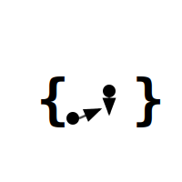
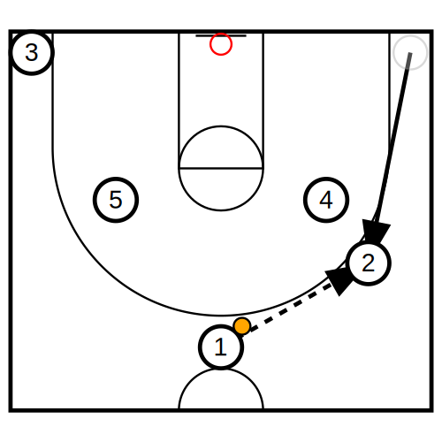

# Playbook Lang



A domain-specific language (DSL) for describing basketball playbooks and generating SVG previews.

[documentation](https://playbook-lang.poteto-mahiro.com/)

## Features

- **Simple DSL**: Human-readable syntax to describe player positions and actions.
- **SVG Generation**: Generates clean, scalable vector graphics for your playbooks.
- **Fast**: Built with Rust for high performance and safety.
- **Wasm Ready**: The core logic is designed to run in both CLI and Web environments.

## Quick Start

### 1. Installation

clone repository

### 2. Write Playbook Code

```playbook
players = { p1, p2, p3, p4, p5 }

state = {
  baller = p1,
  position = {
    p1 = (0, 60),
    p2 = (90, -80),
    p3 = (-90, -80),
    p4 = (50, -10),
    p5 = (-50, -10),
  },
}

action = {
  move = {
    p2 -> (70, 20),
  },
  pass = {
    p1 -> p2:after,
  },
}
```

### 3 Run compile

#### 3.1 Run with pre-built binary

A pre-built CLI is available in the `build/` directory.

```bash
# Convert a sample playbook to SVG
./build/playbook-cli fixtures/input.playbook --output fixtures/output.svg
```

#### 3.2 Build from source

If you have [Rust](https://www.rust-lang.org/) and [just](https://github.com/casey/just) installed:

```bash
# Run all tests
just test

# Convert using cargo
just convert fixtures/input.playbook
```

### 4. Output svg



## License

This project is licensed under the MIT License - see the [LICENSE](LICENSE) file for details.
