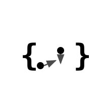
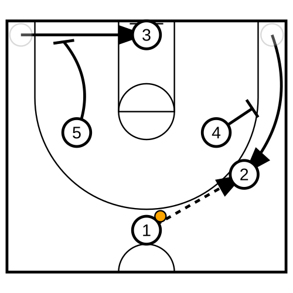

# Playbook Lang



A domain-specific language (DSL) for describing basketball playbooks and generating SVG previews.

[documentation](https://playbook-lang.poteto-mahiro.com/)

[web-playground](https://playbook-lang-app.poteto-mahiro.com/)

## Features

- **Simple DSL**: Human-readable syntax to describe player positions and actions.
- **SVG Generation**: Generates clean, scalable vector graphics for your playbooks.
- **Fast**: Built with Rust for high performance and safety.
- **Wasm Ready**: The core logic is designed to run in both CLI and Web environments.

## Quick Start

### 1. Installation

clone repository

### 2. Write Playbook Code

```playbook
players = { p1, p2, p3, p4, p5 }

state = {
  baller = p1,
  position = {
    p1 = (0, 60),
    p2 = (90, -80),
    p3 = (-90, -80),
    p4 = (50, -10),
    p5 = (-50, -10),
  },
}

actions = [
  action = {
    move = {
      p5 -> (-20, 40),
    },
  },

  action = {
    move = {
      p2 ~> (70, 20),
      p3 -> (0, -80),
    },
    screen = {
      p4 -> p2:middle,
      p5 ~[r]> (-60, -80)
    },
    pass = {
      p1 -> p2:after,
    },
  }
]
```

### 3 Run compile

#### 3.1 Run with pre-built binary

A pre-built CLI is available in the `build/` directory.

```bash
# Convert a sample playbook to SVG
./build/playbook-cli fixtures/input.playbook --output fixtures/output.svg
```

#### 3.2 Build from source

If you have [Rust](https://www.rust-lang.org/) and [just](https://github.com/casey/just) installed:

```bash
# Run all tests
just test

# Convert using cargo
just convert fixtures/input.playbook
```

### 4. Output svg



## Performance & Build

### Build Size & Speed Trade-offs

The project offers two build profiles: **Fast** (default, speed-optimized) and **Small** (size-optimized).

| Component | Profile | Optimization | Size (Approx.) | Performance Impact |
| :--- | :--- | :--- | :--- | :--- |
| **CLI Binary** | `release-cli` (Fast) | `opt-level=3` | **747 KB** | **Baseline (Fastest)** |
| | `release-cli-small` | `opt-level="z"` | **587 KB** (-21%) | ~1.8x slower compile, ~2.6x slower lint |
| **WASM Core** | `release-wasm` (Fast) | `opt-level=3` | **133 KB** | **Baseline (Fastest)** |
| | `release-wasm-small` | `opt-level="z"` | **108 KB** (-19%) | Slower runtime, faster download |

*Note: While `opt-level="z"` is statistically slower (e.g., compile time increases from ~19µs to ~35µs), the difference is negligible for typical usage patterns.*

### Build Commands

Use `just` to build specific profiles:

```bash
# CLI
just release-cli        # Default (Fast)
just release-cli-small  # Small

# WASM (Core / Linter / Formatter)
just release-wasm       # Default (Fast)
just release-wasm-small # Small
```

## License

This project is licensed under the MIT License - see the [LICENSE](LICENSE) file for details.
